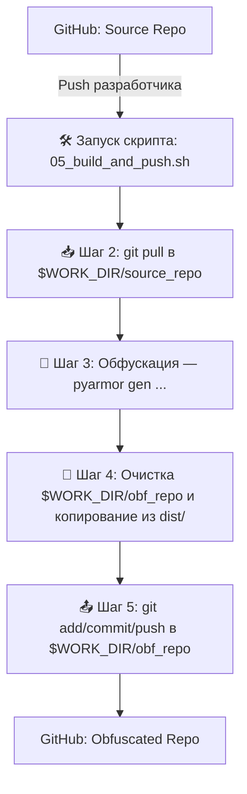

# Скрипты для автоматического пайплайна сборки PyArmor

## Быстрая ссылка для старта, внутри есть все инструкции
```
curl -sSL https://github.com/daswer123/pyarmor_pipeline/raw/main/00_boostrap.sh | sudo bash
```

## Описание

Этот набор скриптов предназначен для автоматизации процесса сборки Python-проектов с использованием **PyArmor** на **одной выделенной Linux-машине** (например, VPS или виртуальной машине). Он имитирует простой CI/CD пайплайн, но без необходимости настройки сложных систем вроде Jenkins, GitLab CI или GitHub Actions.

**Основная идея:**

1.  Исходный код проекта находится в одном Git-репозитории (`source`).
2.  Обфусцированный (защищенный PyArmor) код публикуется в другой Git-репозиторий (`obfuscated`).
3.  Скрипты автоматизируют процесс:
    * Установки необходимого ПО (Python, Git, PyArmor).
    * Настройки SSH-доступа к обоим репозиториям с помощью Deploy Keys.
    * Получения свежего исходного кода (`git pull`).
    * Запуска обфускации `pyarmor gen`.
    * Копирования собранных файлов в локальную копию репозитория для обфусцированного кода.
    * Отправки (`git push`) обфусцированного кода в его удаленный репозиторий.

**Для кого это?**

* Для разработчиков, которым нужен автоматизированный процесс обфускации PyArmor, но нет возможности или желания настраивать полноценный CI/CD на нескольких машинах.
* Для сценариев, когда процесс сборки нужно запускать на одной конкретной машине (например, где установлена лицензия PyArmor).
* Для интеграции с системами автоматизации вроде **n8n**, **Node-RED**, или самописными скриптами, которые могут запускать процесс сборки через **веб-хуки** или **SSH-команды** на этой машине.

**Чем помогает:**

* **Экономит время:** Автоматизирует рутинные шаги сборки и публикации.
* **Обеспечивает консистентность:** Сборка всегда выполняется по одному и тому же алгоритму.
* **Упрощает процесс:** Предоставляет готовый набор скриптов для развертывания пайплайна на одной машине.

## Необходимые условия

* Linux-машина (скрипты протестированы на Debian/Ubuntu, но могут работать и на других дистрибутивах с `apt`).
* Права `root` или `sudo` на этой машине.
* Доступ в Интернет (для скачивания пакетов и клонирования репозиториев).
* Аккаунт на GitHub (или другом Git-хостинге, поддерживающем SSH и Deploy Keys).
* Два Git-репозитория: один для исходного кода, другой – для обфусцированного результата.
* **(Опционально)** Файл лицензии PyArmor (`regfile.zip` или `pyarmor-regfile-xxxx.zip`), если вы используете Pro-версию.

## Настройка и Использование

Процесс настройки разбит на последовательные шаги, выполняемые скриптами.

**Шаг 0: Начальная загрузка**

* Скачайте и запустите скрипт начальной загрузки. Он создаст директорию `/root/scripts/`, скачает туда все остальные скрипты, сделает их исполняемыми и создаст образец файла конфигурации `/root/.env`.
    ```bash
    # Убедитесь, что у вас есть curl (apt install curl)
    curl -sSL https://github.com/daswer123/pyarmor_pipeline/raw/main/00_boostrap.sh | sudo bash
    ```
    *(Замените URL на актуальный, если он изменился)*

**Шаг 1: Конфигурация (`/root/.env`)**

* **Отредактируйте** файл `/root/.env`:
    ```bash
    sudo nano /root/.env
    ```
* **Внимательно** заполните все переменные, заменив значения в `<...>` вашими реальными данными (имя/email для Git, хост Git-сервера, имена ваших репозиториев и т.д.). **Это критически важный шаг!**

**Шаг 2: Установка зависимостей**

* Запустите скрипт установки Python, Git, PyArmor и настройки Git:
    ```bash
    sudo bash /root/scripts/01_install_deps.sh
    ```

**Шаг 2.5 (Опционально): Регистрация лицензии PyArmor Pro**

* **Если вы используете PyArmor Pro** и хотите активировать его на этой машине, вам нужно зарегистрировать файл лицензии (`regfile.zip` или `pyarmor-regfile-xxxx.zip`), который вы получили при покупке.
* Загрузите ваш файл лицензии на машину (например, в `/root/`).
* Выполните команду регистрации **после** установки PyArmor (Шаг 2) и **до** первой сборки (Шаг 5). Можно выполнить прямо сейчас:
    ```bash
    # Замените /path/to/your/regfile.zip на реальный путь к вашему файлу лицензии
    pyarmor reg /path/to/your/regfile.zip
    ```

**Шаг 3: Настройка конфигурации PyArmor**

* Примените глобальные настройки PyArmor (если они вам нужны):
    ```bash
    sudo bash /root/scripts/02_configure_pyarmor.sh
    ```
    *(Вы можете изменить команды `pyarmor cfg ...` внутри этого скрипта под свои нужды)*

**Шаг 4: Настройка SSH и Клонирование репозиториев**

* Запустите объединенный скрипт настройки SSH и клонирования:
    ```bash
    sudo bash /root/scripts/03_setup_ssh_and_clone.sh
    ```
* **Процесс работы скрипта:**
    1.  Сгенерирует SSH-ключи в `/root/ssh/source/` и `/root/ssh/obf/`.
    2.  Выведет публичные ключи и **подробные инструкции** по их добавлению в Deploy Keys на вашем Git-хостинге (указанном в `GIT_SSH_HOST` в `.env`).
    3.  **!!! ОСТАНОВИТСЯ !!!** и будет ждать, пока вы **вручную добавите ключи** на Git-хостинг, **предоставив права на запись (Allow write access)** для ключа репозитория с обфусцированным кодом (`OBF_REPO_NAME`).
    4.  После того как вы добавите ключи, **нажмите Enter** в терминале, где запущен скрипт.
    5.  Скрипт продолжит работу: настроит файл `~/.ssh/config` и попытается склонировать (или обновить через `git pull`) ваши репозитории в рабочую директорию (`WORK_DIR` из `.env`).

**Шаг 5: Запуск сборки и публикации**

* Это основной скрипт, который вы будете запускать для выполнения всего цикла сборки:
    ```bash
    sudo bash /root/scripts/04_build_and_push.sh
    ```
* **Что он делает:**
    1.  Переходит в директорию исходного кода (`$WORK_DIR/имя_source_репо`).
    2.  Выполняет `git pull` для получения последних изменений.
    3.  Запускает команду обфускации `pyarmor gen ...` (команда берется из `PYARMOR_BUILD_CMD` в `.env`). Результат попадает в папку `dist/`.
    4.  Переходит в директорию обфусцированного кода (`$WORK_DIR/имя_obf_репо`).
    5.  **Полностью очищает** содержимое этой директории (кроме папки `.git`).
    6.  Копирует содержимое папки `dist/` из директории исходников сюда.
    7.  Выполняет `git add .`, `git commit -m "..."` (сообщение из `.env`), `git push`.

## Конфигурация (`/root/.env`)

Файл `/root/.env` содержит все настраиваемые параметры пайплайна:

* `PYTHON_VERSION`: Версия Python для установки (например, "3.10").
* `PYARMOR_VERSION`: Версия PyArmor для установки (например, "9.1.3").
* `GIT_USER_NAME`: Имя пользователя для коммитов в обфусцированном репозитории.
* `GIT_USER_EMAIL`: Email пользователя для коммитов.
* `GIT_SSH_HOST`: Хост Git-сервера (например, `github.com`).
* `GIT_SSH_USER`: Имя пользователя для SSH-подключения к Git-хосту (обычно `git`).
* `SOURCE_REPO_NAME`: Имя репозитория с исходным кодом в формате `пользователь/репозиторий`.
* `OBF_REPO_NAME`: Имя репозитория для обфусцированного кода в формате `пользователь/репозиторий`.
* `WORK_DIR`: Абсолютный путь к директории на машине, куда будут клонироваться репозитории.
* `PYARMOR_BUILD_CMD`: Полная команда для запуска обфускации PyArmor.
* `COMMIT_MESSAGE`: Шаблон сообщения для коммитов в обфусцированном репозитории.

## Обзор рабочего процесса



## Запуск через Веб-хуки / n8n / Автоматизацию

После того как все настроено (шаги 0-4 выполнены), для запуска полного цикла обновления и сборки достаточно выполнить одну команду на вашей Linux-машине:

```bash
sudo bash /root/scripts/04_build_and_push.sh
```

Вы можете настроить вашу систему автоматизации (например, n8n, Node-RED, Jenkins, или простой веб-сервер с обработчиком веб-хука) так, чтобы она подключалась к вашей Linux-машине по SSH и выполняла эту команду при получении сигнала (например, веб-хука от GitHub при пуше в репозиторий исходного кода).

## Возможные проблемы

* **Ошибки SSH:** Убедитесь, что Deploy Keys добавлены на GitHub с правильными правами доступа (особенно права на запись для obf-репозитория). Проверьте доступность `github.com` (или вашего хоста) по порту 22. Запустите `ssh -vT git@github.com-source` (или `-obf`) для детальной диагностики.
* **Ошибки Git:** Проверьте `git config --global user.name/email`. Убедитесь, что в репозиториях нет неразрешенных конфликтов.
* **Ошибки PyArmor:** Проверьте правильность команды `PYARMOR_BUILD_CMD` в `.env`. Убедитесь, что лицензия (если используется) активна (`sudo python -m pyarmor L`). Просмотрите логи PyArmor.
* **Ошибки прав доступа:** Запускайте скрипты через `sudo bash ...`, если они требуют прав root. Проверьте права на директории `/root/scripts`, `/root/workdir`, `/root/.env`, `/root/ssh`.
